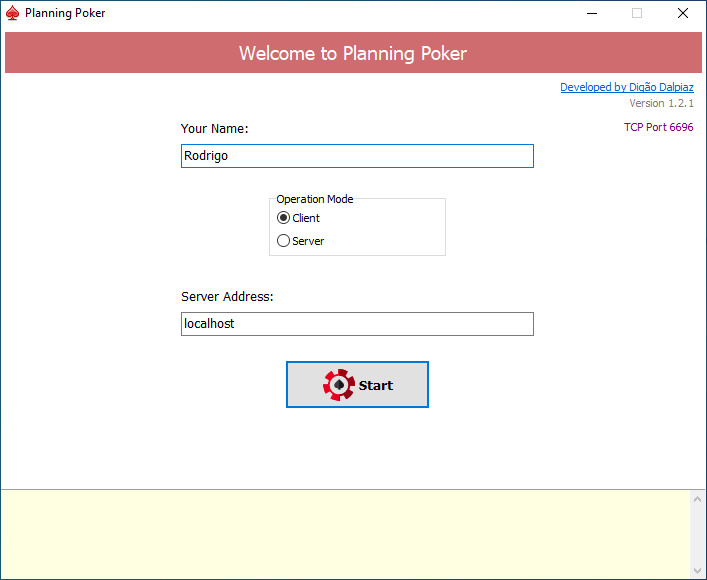
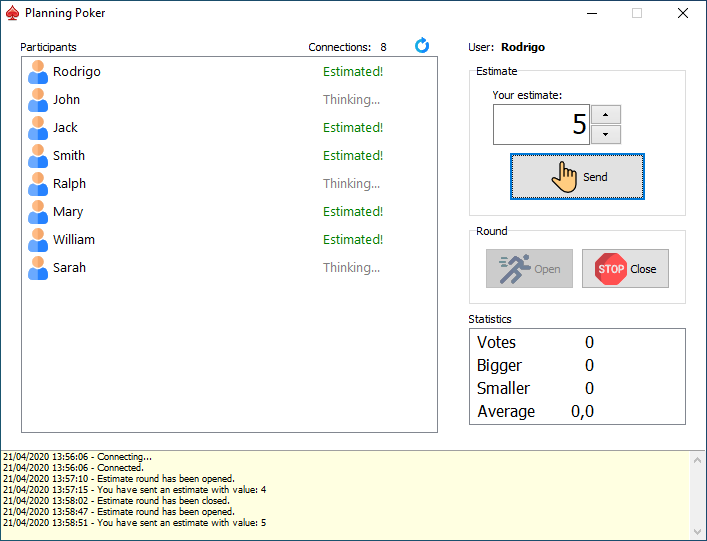
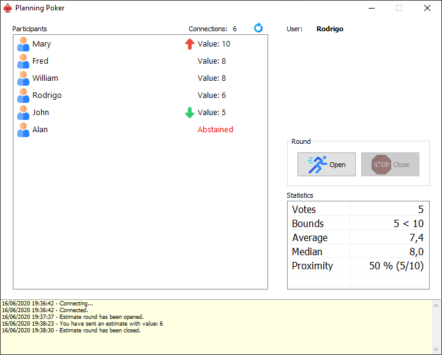

# Planning Poker

## Delphi VCL App to send Sprint Planning Estimates remotely

[Download Planning Poker v1.4.1](https://github.com/digao-dalpiaz/Planning-Poker/releases/download/v1.4.1/PlanningPoker.exe)

## What's New

- 08/10/2020 (Version 1.4.1)

   - Sorting users list by name after sorting by estimate number.

- 07/20/2020 (Version 1.4.0)

   - Updated DzSocket to new authentication control.
   - Implemented TCriticalSection on client list management.
   - Implemented check for user name already connected on client connection.
   - Included server version on wrong version message on client connection.

- 06/16/2020 (Version 1.3.2)

   - Implemented bounds icons on connections list, and sort list by estimate value (issue #5).
   - Implemented version check on application startup (issue #6).

- 06/07/2020 (Version 1.3.1)

   - Fixed "Refresh button" that reveals statistics when a round is in course (issue #4).

- 05/13/2020 (Version 1.3.0)

   - Language support (English and Portuguese-Brazil languages).
   - Implemented Abstain button, to send an estimate with zero value.
   - Auto-close round when all clients have estimate done.

## Description

With this App your team can estimate Sprint task remotely.
Working as client/server, your team needs to choose one member to be the Server, and the others will be clients, just like in a Host/Client game.

The Server and Client App are the same exe, just selecting the operation mode in the Welcome page.

The App uses my Socket component **DzSocket**.
You can get it here: https://github.com/digao-dalpiaz/DzSocket

It works by default on TCP Port 6696. Of course, you can change this port in the source code.

You can use in Local Network and/or Internet environment. To use through the Internet, the server side needs to open TCP port, allowing incoming clients connections to the server.

The operation is quite simple: the users just fill their names and connect to the server. Then the server operator can open a round, when the users will be able to send their estimates. At this time, no one can see the numbers, neither the server. When the estimates are completed, the server operator can close the round, and then the numbers and statistics will be revealed to everyone. :grin:

## Supported languages

- English
- Portuguese Brazil

## Demo Screens

Start page:

Poker page when round is opened:

Poker page when round is closed:

